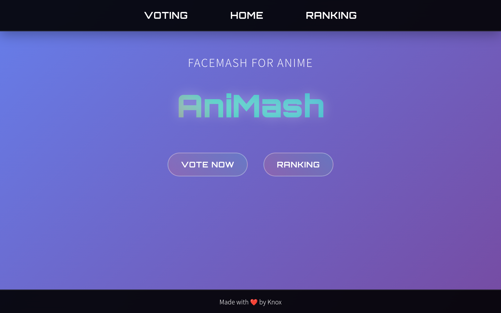
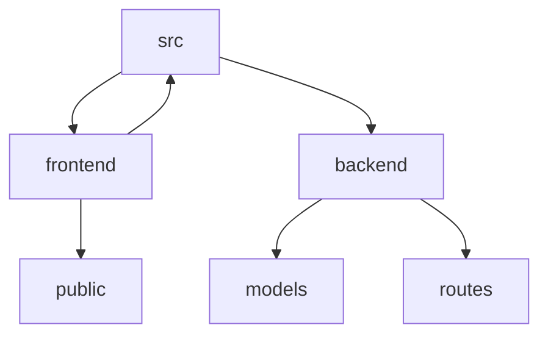

# AniMash: A Full-Stack Voting Application

## 🗂️ Description

AniMash is a full-stack voting application that allows users to vote on their favorite characters. The application consists of a frontend built with React, Vite, and deployed on Vercel, and a backend built with Express, MongoDB, and Mongoose. This project is ideal for developers looking to build a robust and scalable voting application.

The application provides a simple and intuitive interface for users to vote on characters, view the leaderboard, and navigate through different pages. The backend API handles voting data, character information, and leaderboard rankings, ensuring a seamless user experience.

## ✨ Key Features

### **Frontend Features**

* **React-based**: Built with React, a popular JavaScript library for building user interfaces
* **Vite-powered**: Utilizes Vite, a fast and efficient development server for modern web applications
* **Vercel Deployment**: Deployed on Vercel, a platform for building, deploying, and managing modern web applications
* **Responsive Design**: Features a responsive design, ensuring a smooth user experience across various devices and screen sizes

### **Backend Features**

* **Express-based**: Built with Express, a popular Node.js framework for building web applications
* **MongoDB Integration**: Utilizes MongoDB, a NoSQL database for storing voting data and character information
* **Mongoose ORM**: Employs Mongoose, an Object-Relational Mapping (ORM) tool for interacting with MongoDB
* **API Endpoints**: Provides API endpoints for voting, leaderboard data, and character information

## 🗂️ Folder Structure

## 🛠️ Tech Stack

## ⚙️ Setup Instructions

To run the project locally, follow these steps:

* Git clone the repository: `https://github.com/KnoxCodes/AniMash.git`
* Navigate to the project directory: `cd AniMash`
* Install dependencies:
	+ Frontend: `cd frontend && npm install`
	+ Backend: `cd backend && npm install`
* Start the application:
	+ Frontend: `cd frontend && npm run dev`
	+ Backend: `cd backend && npm start`

## 🚀 GitHub Actions

The project utilizes GitHub Actions for continuous integration and deployment. The workflow is defined in the `.github/workflows/main.yml` file and automates the following tasks:

* Builds and deploys the frontend application to Vercel
* Builds and starts the backend application
* Runs tests and linting checks for both frontend and backend

## 📁 API Endpoints

The backend API provides the following endpoints:

* `GET /api/characters`: Retrieves a list of characters
* `POST /api/vote`: Handles voting data for a character
* `GET /api/leaderboard`: Returns the leaderboard rankings

## 💻 Code Structure

The codebase is organized into two main directories: `frontend` and `backend`. The `frontend` directory contains the React application, while the `backend` directory contains the Express server and MongoDB integration.

Key files and directories:

* `frontend/src/main.jsx`: Main entry point for the frontend application
* `backend/index.js`: Main entry point for the backend application
* `backend/models/Character.js`: Mongoose model for characters
* `frontend/src/components/Home.jsx`: React component for the Home page
* `frontend/src/components/Voting.jsx`: React component for the Voting page
* `frontend/src/components/Leaderboard.jsx`: React component for the Leaderboard page

  

<h3>Knox</h3>

 

    
